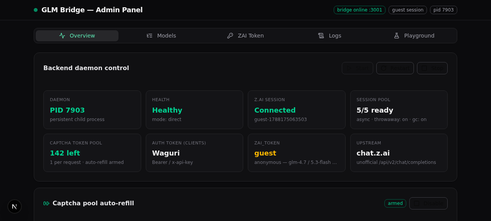
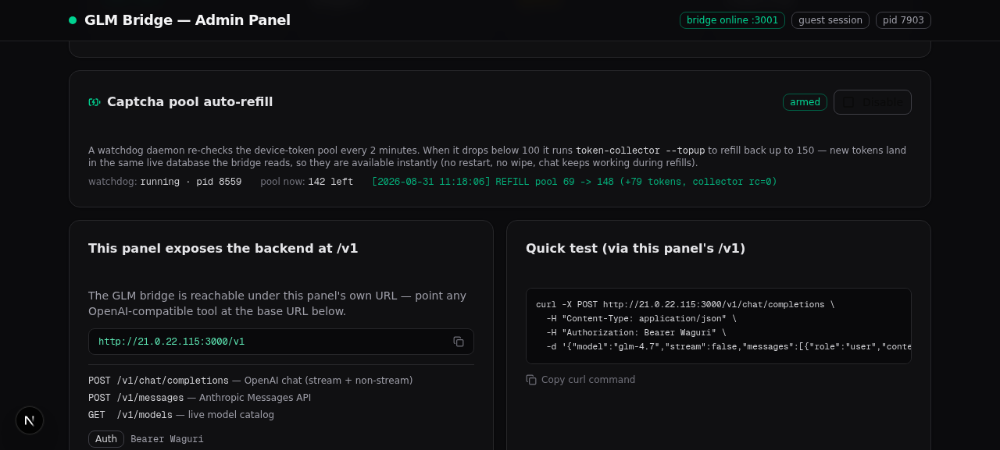
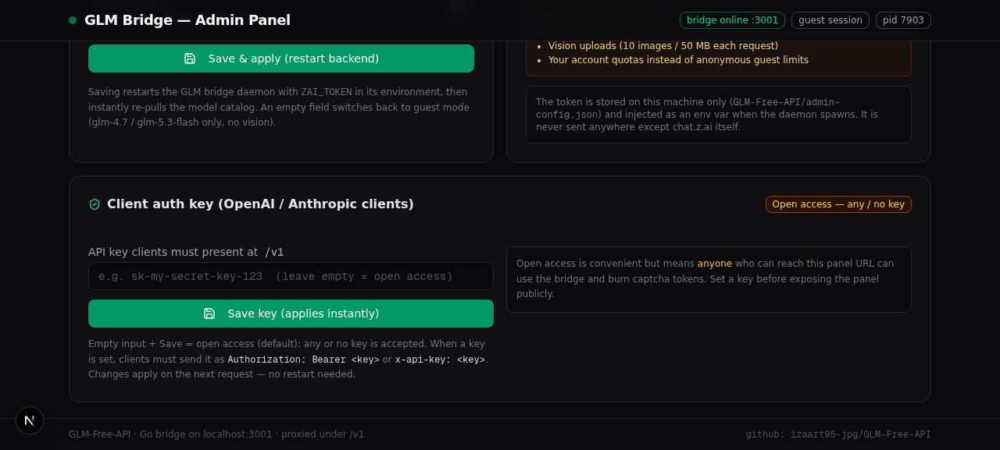

# GLM Bridge — Admin Panel

A complete, self-hosting stack that turns **chat.z.ai (GLM)** into a local **OpenAI- & Anthropic-compatible API**, with a **Next.js admin panel** that manages the whole system: daemon lifecycle, client auth keys, the Z.AI account token, live model catalog, logs, a chat playground — and an **auto-refilling captcha token pool** so the API never runs dry.

> **Bridge**: patched fork of [`izaart95-jpg/GLM-Free-API`](https://github.com/izaart95-jpg/GLM-Free-API) (Go, 13k LOC — MIT, see `GLM-Free-API/LICENSE`).
> **Panel**: custom Next.js 16 app (this repo, `src/`) — the only thing clients and admins touch.



---

## What you get

| Piece | What it does |
|---|---|
| **Go bridge** (`GLM-Free-API/`, port 3001) | Speaks OpenAI `/v1/chat/completions` (+ `/v1/messages` Anthropic, SSE streaming, `reasoning_content`) and translates to Z.AI's unofficial web API — guest **or** logged-in sessions, vision uploads, agent-mode tool calling, throwaway session pool. |
| **Admin panel** (Next.js, port 3000) | 5-tab dashboard: Overview (daemon control + live stats), Models, ZAI Token, Logs, Playground. Also **exposes the bridge under its own URL** at `<panel-url>/v1/*` (reverse proxy) so clients only ever need one base URL. |
| **Ops scripts** (`scripts/`) | Battle-tested daemonizers: `start/stop/status_zai_api.sh`, plus the **token watchdog** (`token_watchdog*.sh`) that keeps the captcha token pool topped up. |
| **Boot hook** (`.zscripts/dev.sh`) | On container/machine start: installs deps, starts the panel, then auto-starts the bridge and the watchdog (guarded — never double-starts). |



## Highlights

- **One base URL for clients** — the panel's `/v1/*` streams straight through to the bridge (SSE untouched, 600 s timeout, CORS open).
- **Client auth, your choice** — default is *open access* (no/any key). Set your own key in the panel and it applies **instantly** (no restart); enforced at the proxy with OpenAI-style 401s. The bridge's internal key (`Waguri`) is never exposed.

  
- **ZAI_TOKEN hot-swap** — paste a JWT from chat.z.ai, hit save → the daemon restarts with the token and the **full GLM-5.x + vision model catalog is pulled immediately**. Empty = guest mode.
- **Captcha token auto-refill** — every chat request burns one headless-browser-captcha "device token". A watchdog daemon tops the pool back up (below 100 → refill to ~150) using a locally **patched** `token-collector --topup` that appends to the live SQLite DB **without wiping it** and **without restarting the bridge** (see [docs/TOKEN-LIFECYCLE.md](docs/TOKEN-LIFECYCLE.md) — the upstream collector nukes the DB by default; the patch is the important bit).
- **Truly persistent processes** — daemons survive shell teardowns, dev-server reloads *and* machine reboots. The full story (setsid/nohup, pidfiles, `/proc` verification, detached spawn from Next.js) is in [docs/PERSISTENCE.md](docs/PERSISTENCE.md).

## Architecture at a glance

```
                       ┌──────────────────────────────────────────────┐
                       │            Next.js admin panel :3000         │
   admin browser ────▶ │  /            admin UI (5 tabs)              │
                       │  /api/admin/*  status/token/models/logs/     │
                       │                control/watchdog/authkey      │
   OpenAI/Anthropic ─▶ │  /v1/*         reverse proxy ── auth here ─┐ │
                       └───────────────────────────────────────────┼─┘
                                                                   │ Bearer <internal>
                       ┌───────────────────────────────────────────▼─┐
                       │           GLM-Free-API bridge :3001         │
                       │  OpenAI + Anthropic → Z.AI translation,     │
                       │  session pool (async, throwaway), agent     │
                       │  mode, vision, STREAM_HOLDBACK              │
                       └───────────────┬─────────────┬───────────────┘
                                       │             │
                       tokens.sqlite ◀─┘             ▼
                        ▲  ▲ (1 device token / request)   chat.z.ai
                        │  │                              (unofficial
             reads pool │  └── harvests ── token-collector  /api/v2)
                        │                    (headless Chromium)
             token watchdog (every 2 min: below 100 → --topup to 150)
```

Full details: [docs/ARCHITECTURE.md](docs/ARCHITECTURE.md).

## Quick start (fresh machine)

Prereqs: **Go ≥ 1.24**, **Node 20+ / Bun**, and Playwright's Chromium for token harvesting.

```bash
# 1 — build the bridge
cd GLM-Free-API
CGO_ENABLED=0 go build -trimpath -ldflags="-s -w" -o zai-api .
CGO_ENABLED=0 go build -trimpath -ldflags="-s -w" -o token-collector ./cmd/token-collector

# 2 — seed the captcha token pool (needs Chromium; see docs/TOKEN-LIFECYCLE.md)
./token-collector --no-tui --tokens 100 --batch 1 --parallel 1

# 2b — captcha signing secret (runtime, gitignored)
echo 'ALIYUN_CAPTCHA_SECRET=<value>' > aliyun.env
#    where <value> is the captcha signing constant published in the upstream
#    repo's internal/zbridge/config.go ("KEY_SECRET" — a public protocol
#    constant extracted from chat.z.ai's frontend; see docs/TOKEN-LIFECYCLE.md)

# 3 — start the bridge
./zai-api --agent-mode &          # or: bash ../scripts/start_zai_api.sh

# 4 — start the panel (from the repo root)
bun install && bun run db:push && bun run dev
#    → panel on :3000, clients point at http://localhost:3000/v1
```

On a container with the `.zscripts` boot hook, steps 3–4 happen automatically on boot.

## Configuration

**`GLM-Free-API/admin-config.json`** (managed by the panel UI — see `admin-config.example.json`):

| Field | Meaning |
|---|---|
| `zaiToken` | JWT from chat.z.ai. Empty = guest session (fewer models, no vision). |
| `agentMode` | Tool-calling shim (modern XML variant). Restarted daemon picks it up. |
| `authKey` | API key clients must present at `/v1`. **Empty = open access.** Applies instantly. |

**Environment overrides** (see [docs/RUNBOOK.md](docs/RUNBOOK.md) for the full table):

| Var | Side | Default | Purpose |
|---|---|---|---|
| `GLM_PROJECT_ROOT` | panel/scripts | `当前前端目录（process.cwd()）` | Where `GLM-Free-API/` + `scripts/` live |
| `GLM_BRIDGE_URL` | panel | `http://localhost:3001` | Where the bridge listens |
| `PORT` / `HOST` | bridge | `3001` / `0.0.0.0` | Bind address (panel forces `PORT=3001` when spawning) |
| `TARGET` / `REFILL_BELOW` / `CHECK_EVERY` | watchdog | `150` / `100` / `120` | Pool top-up policy |
| `ALIYUN_CAPTCHA_SECRET` | bridge | placeholder | HMAC secret for Aliyun captcha calls — **required**, loaded from `GLM-Free-API/aliyun.env` (gitignored) |

## Endpoints (through the panel)

| Route | Purpose |
|---|---|
| `POST /v1/chat/completions` | OpenAI chat, stream + non-stream, `reasoning_content` included |
| `POST /v1/messages` | Anthropic Messages API |
| `GET /v1/models` | Live model catalog (depends on guest vs token mode) |
| `GET /health`, `GET /status` | Bridge health / Z.AI session + pool info (bridge port) |

Auth: `Authorization: Bearer <authKey>` or `x-api-key: <authKey>` — or nothing, while access is open.

## Management

```bash
bash scripts/status_zai_api.sh                       # bridge process + health + log tail
bash scripts/start_zai_api.sh --agent-mode           # daemonize bridge (nohup setsid + pidfile)
bash scripts/stop_zai_api.sh
bash scripts/token_watchdog_ctl.sh status|stop|start # auto-refill daemon
```

Everything above is also clickable in the panel — same pidfiles, same binaries.

## Repository layout

```
├── GLM-Free-API/        patched Go bridge (upstream + --topup collector patch)
├── src/                 Next.js admin panel (app router, shadcn/ui, dark theme)
│   ├── app/v1/[...path] the /v1 reverse proxy (auth enforcement + SSE passthrough)
│   ├── app/api/admin/   status · token · models · logs · control · watchdog · authkey
│   └── lib/             daemon manager (spawn/pid/health), watchdog manager
├── scripts/             daemonizers + token watchdog (env-parameterized)
├── .zscripts/dev.sh     boot hook: panel + bridge + watchdog auto-start
├── docs/                ARCHITECTURE · PERSISTENCE · TOKEN-LIFECYCLE · RUNBOOK
└── admin-config.example.json
```

## Docs

| Doc | Contents |
|---|---|
| [ARCHITECTURE](docs/ARCHITECTURE.md) | Components, request walkthrough, admin API surface, panel internals |
| [PERSISTENCE](docs/PERSISTENCE.md) | Why plain `&` dies here; setsid/nohup daemonization; pidfile + `/proc` verification; detached spawn from Next.js; boot sequence; what survives what |
| [TOKEN-LIFECYCLE](docs/TOKEN-LIFECYCLE.md) | Captcha device tokens, the 1-per-request burn model, the DB-wipe trap, the `--topup` patch, watchdog design |
| [RUNBOOK](docs/RUNBOOK.md) | Setup checklist, daily ops, env vars, logs, troubleshooting matrix |

## Local patches to the upstream bridge

1. `token-collector --topup` — append to `tokens.sqlite` instead of deleting it (unique index on `token`, `INSERT OR IGNORE`), so refills are safe while the bridge is running. See [docs/TOKEN-LIFECYCLE.md](docs/TOKEN-LIFECYCLE.md#the-wipe-trap-and-the---topup-patch).
2. Aliyun captcha secret moved out of source into `GLM-Free-API/aliyun.env` (`ALIYUN_CAPTCHA_SECRET`, loaded by the spawn paths with `set -a` / by the panel's daemon manager). Upstream ships a redacted AccessKey ID + the signing secret as source constants; the captcha endpoint ignores the ID but validates the HMAC — so the secret must be real at runtime. See [docs/TOKEN-LIFECYCLE.md](docs/TOKEN-LIFECYCLE.md#the-captcha-signing-secret).
3. **Stream-truncation hardening** — four fixes so clients never see `Response truncated — stream ended before completion`:
   - Graceful-shutdown drain raised from a hardcoded 10s to `STREAM_DRAIN_TIMEOUT` (default **180s**, `config.go` + `run.go`) — in-flight streams run to completion across panel restarts; the panel's stop path waits 200s before SIGKILL (it must out-wait the drain).
   - OpenAI stream error paths now emit a `finish_reason:"stop"` chunk before `[DONE]` (framing-complete close; the Anthropic path already did this).
   - The SSE parser keeps draining after `phase:"done"` so a trailing `edit_content` tail-splice sent after done is applied instead of dropped (`zai.go`).
   - The panel's `/v1` proxy stream cap raised 10 min → 60 min (`AbortSignal.timeout` spans body streaming).

## Credits & license

- Bridge: hard fork of [izaart95-jpg/GLM-Free-API](https://github.com/izaart95-jpg/GLM-Free-API) — MIT, © 2026 Lelouch (license preserved in `GLM-Free-API/LICENSE`).
- Panel, scripts, docs: MIT — see [LICENSE](LICENSE).
- This project drives an **unofficial** API of chat.z.ai. For personal/experimental use; respect the upstream service and its terms.
